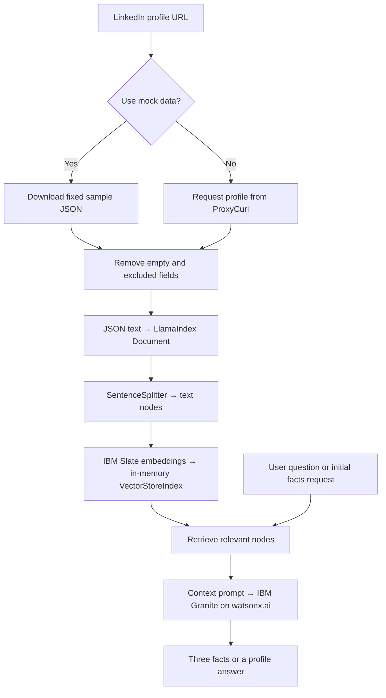

# LinkedIn Icebreaker Bot — LlamaIndex + IBM Granite

A Python learning project that turns LinkedIn profile data into three career or education facts and answers questions about the profile. It uses **LlamaIndex** for retrieval-augmented generation (RAG), **IBM Granite through watsonx.ai** for text generation, and **IBM Slate** for embeddings. A Gradio interface connects the workflow.

The input is a LinkedIn **profile URL**, not a person's name. The generated facts provide material for conversation starters; there is no separate icebreaker-message generator or LinkedIn name-search implementation.

> **Current status:** The main processing functions and web UI are implemented, but the project still has integration issues described below. The CLI entry point remains disabled. This README documents the checked-in implementation; a successful end-to-end model run has not been verified.

## Contents

- [How it works](#how-it-works)
- [Project layout](#project-layout)
- [Technology roles](#technology-roles)
- [Code walkthrough](#code-walkthrough)
- [Function and data contracts](#function-and-data-contracts)
- [Illustrative profile example](#illustrative-profile-example)
- [Setup](#setup)
- [Run the web interface](#run-the-web-interface)
- [CLI status](#cli-status)
- [Configuration reference](#configuration-reference)
- [Known implementation issues](#known-implementation-issues)
- [Verification](#verification)
- [Data handling](#data-handling)
- [Acknowledgments](#acknowledgments)

## How it works



1. **Extract:** `extract_linkedin_profile()` downloads a fixed sample in mock mode or calls the ProxyCurl endpoint configured in the code. It removes empty values, `people_also_viewed`, `certifications`, and group profile-picture URLs.
2. **Split:** The cleaned dictionary is serialized as JSON and wrapped in a LlamaIndex `Document`. `SentenceSplitter` creates chunks with a configured size of 500 tokens; overlap uses the library default.
3. **Index:** The application constructs a watsonx embedding adapter and a `VectorStoreIndex`. No external vector database or disk persistence is configured. The embedding adapter wiring currently needs correction; see known issues.
4. **Generate facts:** A query engine retrieves up to seven relevant nodes and asks Granite for three facts about career or education.
5. **Answer questions:** Each question uses retrieval and a context-based prompt. The prompt requests an “I don't know” response when the information is absent; this is an instruction to the model, not a guarantee.

The web app stores each index in an in-memory dictionary keyed by a UUID. Chat history is displayed in the UI, but previous messages are **not passed to the model**. Ask self-contained questions rather than relying on conversational memory.

## Project layout

```text
Icebreaker_bot_with_LlamaIndex/
├── README.md                     # Project overview and setup
├── resources/
│   └── image.png                 # Existing image asset
└── icebreaker/
    ├── README.md                 # Link to this guide
    ├── requirements.txt          # Declared dependency pins
    ├── config.py                 # Models, service settings, prompts, retrieval settings
    ├── app.py                    # Gradio UI and in-memory session indices
    ├── main.py                   # CLI parser and processing/chat functions
    ├── test_config.py            # Configuration printout smoke check
    └── modules/
        ├── __init__.py           # Module exports
        ├── data_extraction.py    # Sample JSON / ProxyCurl extraction and cleanup
        ├── data_processing.py    # Document splitting, indexing, embedding checks
        ├── llm_interface.py      # watsonx model factories and model selection
        └── query_engine.py       # Facts generation and question answering
```

The local `icebreaker-env/` environment and Python caches are omitted from this tree.

## Technology roles

| Component | Responsibility in this project |
| --- | --- |
| LlamaIndex | Represents profile text as documents/nodes, constructs the vector index, retrieves relevant chunks, and orchestrates prompt-based answers. |
| IBM Slate | Intended embedding model: converts profile chunks and retrieval queries into numerical representations for similarity search. |
| IBM Granite | Default language model: generates facts and answers from retrieved text. |
| IBM watsonx.ai | Remote service used by the IBM embedding and LLM adapters. The project does not load model weights locally. |
| Requests | Fetches the sample JSON or the live profile response over HTTP. |
| ProxyCurl | Live profile data source called by the extraction module; separate from IBM inference. |
| Gradio | Builds the two-tab web interface and connects UI events to Python functions. |

LlamaIndex is the orchestration library; it is distinct from the optional Meta Llama model in the dropdown. This implementation is a fixed RAG pipeline: it does not train or fine-tune Granite, and it has no autonomous agent, tool-selection loop, or web-search agent.

## Code walkthrough

The excerpts below come from the current Python files, with indentation normalized where needed. They explain the implementation as it exists, including unresolved issues; they are not independent, ready-to-run programs.

### 1. Configuration and prompt contracts

Source: [config.py](icebreaker/config.py).

Configuration is a Python module imported throughout the application. Model factories read its service/model settings; processing reads the chunk size; query functions read retrieval and generation settings. The question prompt defines the two placeholders that the query engine uses:

```python
USER_QUESTION_TEMPLATE = """
You are an AI assistant that provides detailed answers to questions based on the provided context.

Context information is below:

{context_str}

Question: {query_str}

Answer in full details, using only the information provided in the context. If the answer is not available in the context, say "I don't know. The information is not available on the LinkedIn page."
"""
```

`{context_str}` represents retrieved profile text and `{query_str}` represents the user's question. `PromptTemplate` wraps the string before it is supplied as `text_qa_template` to the query engine. The initial-facts template only contains `{context_str}` because its task is already stated in the prompt.

The intended grounding is narrow: answers should use the available profile context. Missing information in the retrieved chunks is not proof that it is absent from the original profile, and a prompt instruction alone cannot enforce factual correctness.

### 2. Fetch and clean a profile

Source: [data_extraction.py](icebreaker/modules/data_extraction.py), `extract_linkedin_profile()`.

The function accepts a profile URL, an optional ProxyCurl key, and the `mock` flag. Mock mode fetches `config.MOCK_DATA_URL` with a 30-second request timeout. Live mode sends a bearer-authorized GET request with these parameters:

```python
headers = {"Authorization": f"Bearer {api_key}"}
params = {
    "url": linkedin_profile_url,
    "fallback_to_cache": "on-error",
    "use_cache": "if-present",
    "skills": "include",
    "inferred_salary": "include",
    "personal_email": "include",
    "personal_contact_number": "include",
}
```

The cache options are sent to the provider; the application itself does not implement a local profile cache. Both request paths expect a JSON object and only process HTTP status `200` as success. The cleanup step is:

```python
data = {
    k: v
    for k, v in data.items()
    if v not in ([], "", None) and k not in ["people_also_viewed", "certifications"]
}

if data.get("groups"):
    for group_dict in data.get("groups"):
        group_dict.pop("profile_pic_url", None)
```

The dictionary comprehension filters top-level values equal to an empty list, empty string, or `None`, and drops two named fields. It does not recursively remove every empty field. The subsequent loop removes only the picture URL from each group object. In particular, removing `certifications` means those records cannot later support answers through this pipeline.

Network exceptions, non-200 responses, and JSON parsing failures return `{}` after logging. A missing live-mode key raises `ValueError` before the request; that exception is handled by the outer UI/CLI processing function. Unexpected JSON shapes have no dedicated schema validation.

### 3. Convert profile JSON into searchable nodes

Source: [data_processing.py](icebreaker/modules/data_processing.py), `split_profile_data()`.

```python
profile_json = json.dumps(profile_data)

document = Document(text=profile_json)

# Split the document into nodes using SentenceSplitter
splitter = SentenceSplitter(chunk_size=config.CHUNK_SIZE)
nodes = splitter.get_nodes_from_documents([document])
```

The transformations are `dict → JSON string → Document → list of nodes`. A `Document` is the input text container, and nodes are smaller pieces that retrieval can select independently. The code uses one serialized JSON document rather than separate documents for experience, education, and skills.

`CHUNK_SIZE=500` controls the splitter's token budget; it is not 500 characters or 500 JSON fields. No explicit overlap or field-aware splitting rule is supplied. The resulting chunks are text and need not each be valid standalone JSON. A splitting exception returns an empty list, which the web processing function checks before indexing.

### 4. Create IBM embeddings and the vector index

Sources: [llm_interface.py](icebreaker/modules/llm_interface.py), `create_watsonx_embedding()`, and [data_processing.py](icebreaker/modules/data_processing.py), `create_vector_database()`.

The embedding factory currently contains:

```python
wastonx_embedding = WatsonxEmbeddings(
    model_id=config.EMBEDDING_MODEL_ID,
    url=config.WATSONX_URL,
    project_id=config.WATSONX_PROJECT_ID,
    trucate_input_tokens=3
)
```

It selects the configured Slate model and watsonx project. The argument `trucate_input_tokens` is misspelled in the source; see the known-issues section before using this factory. The intended embedding model is then passed into the index constructor:

```python
embedding_model = create_watsonx_embedding()

index = VectorStoreIndex(
    nodes=nodes,
    embedding_model=embedding_model,
    show_progress=True,
)
```

The installed constructor expects `embed_model`, so the shown `embedding_model` keyword does not establish the intended integration correctly. After that is corrected, this stage is intended to embed nodes and place them in LlamaIndex's default in-memory vector store. Despite the function name, it does not provision a database server, connect ChromaDB, or save an index to disk. Index-construction errors are logged and returned as `None`.

`verify_embeddings()` attempts to look up a vector for every indexed node:

```python
vector_store = index._storage_context.vector_store
node_ids = list(index.index_struct.nodes.keys())
missing_embeddings = False

for node_id in node_ids:
    embedding = vector_store.get(node_id)
```

This code relies on internal index/storage attributes and currently references `nodes`, while the inspected index implementation uses `nodes_dict`. The function catches failures and returns `False`. Its intended check is only that vectors exist; it does not measure relevance, vector quality, or answer accuracy. In the web flow, a failed check produces a warning and does not stop fact generation.

### 5. Construct the Granite language-model adapter

Source: [llm_interface.py](icebreaker/modules/llm_interface.py), `create_watsonx_llm()`.

```python
addition_params = {
    "decoding_method": decoding_method,
    "min_new_tokens": config.MIN_NEW_TOKENS,
    "top_k": config.TOP_K,
    "top_p": config.TOP_P,
}

wastonx_llm = WatsonxLLM(
    model_id=config.LLM_MODEL_ID,
    url=config.WATSONX_URL,
    project_id=config.WATSONX_PROJECT_ID,
    temperature=temperature,
    max_new_tokens=max_new_tokens,
    additional_params=addition_params
)
```

The factory separates model/service identity from generation controls. It returns a `WatsonxLLM` adapter; the later query-engine invocation requests text generation. The factory defaults to 500 output tokens, but both application query paths override that value.

| Path | Decoding | Temperature | Maximum new tokens |
| --- | --- | --- | --- |
| Initial facts | `sample` | `config.TEMPERATURE` (`0.0`) | `config.MAX_NEW_TOKENS` (`700`) |
| User question | `greedy` | `0.0` | `250` |

`SIMILARITY_TOP_K` and `TOP_K` serve different purposes: the first limits retrieved chunks; the second is passed to the model as a generation parameter. `change_llm_model()` assigns a new value to `config.LLM_MODEL_ID`, which affects subsequent model-factory calls process-wide.

### 6. Generate the initial three facts

Source: [query_engine.py](icebreaker/modules/query_engine.py), `generate_initial_facts()`.

After creating the LLM with the initial-facts generation settings, the function configures a query engine:

```python
facts_prompt_template = PromptTemplate(template=config.INITIAL_FACTS_TEMPLATE)

#create a query engine with the LLM and prompt template
query_engine = index.as_query_engine(
    streaming=False,
    similarity_top_k=config.SIMILARITY_TOP_K,
    llm=wastonx_llm,
    text_qa_template=facts_prompt_template
)

#Execute the query to generate facts
query = "Provide three interesting facts about this person's career or education."
response = query_engine.query(query)

return response.response  # Return the generated facts as a string
```

`index.as_query_engine()` combines retrieval and answer generation. The fixed query supplies the retrieval request, while the prompt asks the model to produce three career or education facts. `streaming=False` means the caller receives the completed response rather than a token stream. The function extracts `response.response` and returns plain text to the UI or CLI.

The implementation does not parse or enforce an exactly-three-items output schema. If generation raises an exception, it returns the literal error message `An error occurred while generating facts.`; the web caller currently still wraps that text in a success heading.

### 7. Answer a question with retrieved context

Source: [query_engine.py](icebreaker/modules/query_engine.py), `answer_user_query()`.

The function first performs an explicit retrieval:

```python
base_retriver = index.as_retriever(similarity_top_k=config.SIMILARITY_TOP_K)
source_nodes = base_retriver.retrieve(user_query)

context_str = "\n\n".join([node.get_text() for node in source_nodes])
```

This selects relevant nodes and joins their text. However, the constructed `context_str` variable is not supplied to the model or query engine. The function subsequently creates a query engine with `USER_QUESTION_TEMPLATE` and calls `query_engine.query(user_query)`, which performs its own retrieval. Consequently, the explicit retrieval above is redundant in the current implementation.

On success this function returns the LlamaIndex response object, unlike `generate_initial_facts()`, which returns a string. On failure it returns a plain error string. That mixed return contract matters because the web caller always reads `.response`; the CLI caller handles either form with `hasattr()`.

### 8. Orchestrate profile processing and session state

Source: [app.py](icebreaker/app.py), `process_profile()` and `chat_with_profile()`.

The processing handler changes the selected model if necessary, substitutes a default URL for a blank mock-mode input, and calls extraction, splitting, indexing, verification, and fact generation in order. Once it has an index and the returned facts text, it stores the index:

```python
session_id = str(uuid.uuid4())

active_indices[session_id] = index
```

`active_indices` is a module-level dictionary. The returned UUID is written to a hidden Gradio textbox and supplied to later chat events. Each successful processing attempt creates another dictionary entry; there is no automatic expiry or eviction. The hidden ID is a lookup key, not an authentication system.

The chat handler rejects a missing or unknown session, ignores whitespace-only questions for a valid session, and otherwise follows this path:

```python
index = active_indices[session_id]

# Answer the user's query
response = answer_user_query(index, user_query)

# Update chat history
return chat_history + [[user_query, response.response]]
```

The list of `[question, answer]` pairs is presentation state. Only `user_query` and the selected profile index reach `answer_user_query()`. Questions such as “What did they do before that?” therefore lack the earlier conversational context unless the current question itself is sufficient.

Processing a new profile changes the hidden session ID but does not explicitly clear the displayed chat history. Existing visible answers can therefore refer to the previously processed profile even though subsequent queries use the new index.

### 9. Wire Python handlers into the Gradio interface

Source: [app.py](icebreaker/app.py), `create_gradio_interface()`.

```python
process_btn.click(
    fn=process_profile,
    inputs=[linkedin_url, api_key, use_mock, model_dropdown],
    outputs=[result_text, session_id]
)
```

The order of `inputs` corresponds to the processing function's positional arguments. Its two return values populate the initial-facts textbox and hidden session field. Both the **Send** button and pressing Enter in the question box call `chat_with_profile()` with the session ID, question, and current chat history; only the chatbot component is updated.

The interface is built using `gr.Blocks`, with a profile-processing tab and a chat tab. Launch is guarded by `if __name__ == "__main__"`, binds to `127.0.0.1:5000`, and currently requests a public share link.

### 10. Understand the command-line path and package imports

Sources: [main.py](icebreaker/main.py) and [modules/__init__.py](icebreaker/modules/__init__.py).

`main()` parses arguments, prompts for missing input, decides mock/live mode, and optionally changes the LLM. `process_linkedin()` already implements the pipeline and calls `chatbot_interface()`, but its invocation from `main()` remains commented out. The interactive loop reads questions until an exit keyword and prints each response; its one-second `sleep` is a simulated delay, not model timing or a retry strategy.

The CLI processing path does not explicitly reject an empty node list or call `verify_embeddings()`, unlike the web flow. Both paths reuse the same extraction, index-building, and query functions.

`modules/__init__.py` re-exports functions from all four modules using eager imports. Importing the package can therefore require the IBM/LlamaIndex dependencies even when the intended operation only concerns extraction. The top-level `import config` statements also explain why the usage commands run from `icebreaker/`.

## Function and data contracts

| Function | Input | Success result | Failure behavior |
| --- | --- | --- | --- |
| `extract_linkedin_profile()` | URL, optional key, mock flag | Cleaned profile dictionary | `{}` for handled HTTP/network/JSON failures; some validation/shape errors propagate |
| `split_profile_data()` | Profile dictionary | List of nodes | `[]` |
| `create_watsonx_embedding()` | Configuration | IBM embedding adapter | Exceptions propagate to caller |
| `create_vector_database()` | Nodes | `VectorStoreIndex` | `None` |
| `verify_embeddings()` | Index | `True` | `False`, including caught verification errors |
| `create_watsonx_llm()` | Generation options plus configuration | IBM LLM adapter | Exceptions propagate to caller |
| `change_llm_model()` | Model ID | `None`; updates global configuration | No local validation of model availability |
| `generate_initial_facts()` | Index | Facts string | Error string |
| `answer_user_query()` | Index and question | Response object | Error string |
| `process_profile()` | Four UI inputs | `(display_text, session_id)` | `(error_text, None)` for handled processing failures |
| `chat_with_profile()` | Session, question, history | Updated message-pair list | Adds an error pair for handled failures |
| `process_linkedin()` | URL, key, mock flag | Runs interactive loop; returns `None` | Logs handled processing exceptions |

The main data path is:

```text
HTTP JSON object
  → cleaned Python dict
  → serialized JSON text
  → LlamaIndex Document
  → text nodes
  → intended Slate vectors + in-memory index
  → retrieved profile chunks + question prompt
  → Granite response
  → text displayed by Gradio or the CLI
```

## Illustrative profile example

The following is invented data for understanding the transformation, not the downloaded sample and not an observed model result:

```json
{
  "full_name": "Alex Example",
  "headline": "Data Engineer",
  "experiences": [
    {"title": "Data Engineer", "company": "Example Analytics"}
  ],
  "education": [
    {"school": "Example University", "degree_name": "Computer Science"}
  ],
  "certifications": [{"name": "Example Certification"}],
  "people_also_viewed": [],
  "summary": null
}
```

Extraction removes `certifications`, `people_also_viewed`, and the null `summary`. The remaining dictionary becomes JSON text for chunking. For a question such as “Which company is listed in Alex's experience?”, relevant context would include `Example Analytics`, and the intended answer would identify that company. A question about an unlisted graduation year should trigger the prompt's missing-information response. Neither answer has been generated or validated here.

## Setup

Use Python 3.11 or later as the project's intended baseline. Python 3.12 is present in the inspected local environment. Dependency compatibility must be resolved before treating this as a reproducible installation.

From the project root:

```bash
cd icebreaker
python3 -m venv .venv
source .venv/bin/activate
python -m pip install --upgrade pip
python -m pip install -r requirements.txt
python -m pip check
```

On Windows PowerShell, activate with `.venv\Scripts\Activate.ps1`.

The dependency file includes LlamaIndex, its IBM integrations, the IBM watsonx SDK, Requests, and Gradio. It also lists LangChain, ChromaDB, and PDF/web-reader packages that the current application pipeline does not use. Installation of the declared pins has not been validated, and the existing environment differs substantially from those pins.

### Configure IBM watsonx.ai

Edit `icebreaker/config.py` to match an accessible watsonx project and region:

```python
WATSONX_URL = "https://us-south.ml.cloud.ibm.com"
WATSONX_PROJECT_ID = "your-watsonx-project-id"
LLM_MODEL_ID = "ibm/granite-4-h-small"
EMBEDDING_MODEL_ID = "ibm/slate-125m-english-rtrvr-v2"
```

The checked-in project ID is `skills-network`, a course-oriented value. A standalone IBM Cloud setup needs its own project and credentials, with access to the configured models. Model IDs in the source are configuration choices, not confirmation of their availability in every project or region.

The application does not explicitly supply a watsonx API key to either model constructor. The installed IBM embedding integration supports `WATSONX_APIKEY` or `WATSONX_TOKEN` from the environment. For API-key authentication, set the variable in the same terminal before starting the app:

```bash
export WATSONX_APIKEY="your-ibm-cloud-api-key"
```

Verify authentication support for both IBM adapters in the dependency versions you install. There is no `.env` loader in the application; merely creating a `.env` file does not load these values. URL and project ID are explicitly passed from `config.py`.

### Profile data modes

- **Mock mode:** Downloads the fixed sample JSON at `MOCK_DATA_URL`. The entered LinkedIn URL does not select a different sample. No ProxyCurl key is needed, but internet access and watsonx authentication are still required for the full pipeline.
- **Live mode:** Uncheck **Use Mock Data**, enter a LinkedIn profile URL and a ProxyCurl API key. The code calls `https://nubela.co/proxycurl/api/v2/linkedin`; current service availability has not been verified. The UI key field or `PROXYCURL_API_KEY` in `config.py` supplies the key. A blank key does not automatically turn on mock mode despite the field's label.

## Run the web interface

After resolving the integration issues below, run from `icebreaker/`:

```bash
python app.py
```

Open **http://127.0.0.1:5000**.

1. In **Process LinkedIn Profile**, keep **Use Mock Data** checked for the sample, or configure live mode.
2. Select the model and click **Process Profile**.
3. Read the three initial facts.
4. Open **Chat** and ask a question such as “What is this person's current job title?” or “What education is listed in the profile?”

The model dropdown contains `ibm/granite-4-h-small` and `meta-llama/llama-3-2-11b-vision-instruct`. The app sends text context, including when the second model is selected.

**Launch behavior:** `app.py` currently sets `share=True`, which asks Gradio to create a public share link. Set `share=False` in `demo.launch()` for local use. The current implementation has no application authentication, session cleanup, or durable storage. Restarting the process loses all profile indices.

## CLI status

`main.py` defines `--url`, `--api-key`, `--mock`, and `--model`, and implements profile processing and an interactive question loop. However, `main()` comments out the call to `process_linkedin()` and prints a starter-template message instead. Running `python main.py --mock` therefore does **not** execute the RAG pipeline and still prompts for a URL when none is supplied.

To enable the CLI, uncomment this existing line in `main()` and remove the starter message:

```python
process_linkedin(linkedin_url, api_key, mock=use_mock)
```

Once enabled and the integration issues are addressed, examples are:

```bash
# A URL avoids the input prompt; mock mode still loads the fixed sample.
python main.py --mock --url "https://www.linkedin.com/in/example/"

# Live mode prompts for a ProxyCurl key if config.py has none.
python main.py --url "https://www.linkedin.com/in/example/"
```

Enter `exit`, `quit`, or `bye` to leave the chat loop. The optional `--model` flag changes the configured LLM ID.

## Configuration reference

| Setting | Checked-in value | Role |
| --- | --- | --- |
| `WATSONX_URL` | `https://us-south.ml.cloud.ibm.com` | IBM inference endpoint |
| `WATSONX_PROJECT_ID` | `skills-network` | Project passed to the IBM adapters |
| `LLM_MODEL_ID` | `ibm/granite-4-h-small` | Default text-generation model |
| `EMBEDDING_MODEL_ID` | `ibm/slate-125m-english-rtrvr-v2` | Profile/query embedding model |
| `CHUNK_SIZE` | `500` | Splitter token budget per chunk |
| `SIMILARITY_TOP_K` | `7` | Retrieval result limit |
| `TEMPERATURE` | `0.0` | Initial-facts generation temperature |
| `MAX_NEW_TOKENS` | `700` | Initial-facts output limit |
| `MIN_NEW_TOKENS` | `1` | Shared generation minimum |
| `TOP_K` / `TOP_P` | `50` / `1` | Generation sampling settings |
| `PROXYCURL_API_KEY` | Empty string | Optional default live-profile key |

Initial facts use `sample` decoding. Question answering explicitly uses `greedy` decoding, temperature `0.0`, and a **250-token** output limit, independently of `MAX_NEW_TOKENS`. `INITIAL_FACTS_TEMPLATE` and `USER_QUESTION_TEMPLATE` control the prompts.

## Known implementation issues

These observations come from source inspection and, where noted, inspection of the installed library source. They have not been fixed as part of this documentation update.

| Issue | Effect / next step |
| --- | --- |
| `VectorStoreIndex(..., embedding_model=...)` | The installed LlamaIndex constructor expects `embed_model`. Correct the keyword so the intended IBM adapter is used rather than leaving embedding selection to library defaults. |
| `trucate_input_tokens=3` in `create_watsonx_embedding()` | The option is misspelled; the installed adapter declares `truncate_input_tokens`. Review the intended token limit as well: truncating to three tokens would discard most chunk content. |
| `index.index_struct.nodes` in `verify_embeddings()` | The installed vector-index implementation uses `nodes_dict`. Revisit the node-ID lookup and verification logic. The UI logs a warning and continues when this check fails. |
| Disabled CLI pipeline call | `main()` currently only parses/prompts and prints a starter message; enable the existing processing call to use the CLI. |
| Installed packages differ from `requirements.txt` | For example, the inspected environment contains LlamaIndex core `0.14.24`, IBM embeddings `0.7.0`, and Gradio `6.27.0`, while the file pins `0.11.8`, `0.2.0`, and `4.44.1`. Establish one compatible dependency set. The UI uses pair-based chat history, which also needs checking against the installed Gradio version. |
| Inconsistent query-error return type | `answer_user_query()` returns a string on failure, but the web chat accesses `response.response`. This can obscure the underlying model error with an attribute error. |
| Facts errors can appear under a success heading | `generate_initial_facts()` catches exceptions and returns error text; profile processing does not distinguish that text from generated facts. Check logs when the output contains an error. |
| Model selection is global | `change_llm_model()` mutates `config.LLM_MODEL_ID` for the whole process, so concurrent sessions do not have independent model settings. |
| Duplicate retrieval in question answering | `answer_user_query()` retrieves nodes and constructs `context_str`, but does not use that variable; the query engine retrieves again. |

For extraction failures, check the HTTP status and timeout logs. For indexing or generation failures, check IBM authentication, project/model access, dependency versions, and the adapter issues above. Mock mode only bypasses ProxyCurl; it does not bypass IBM inference.

## Verification

From `icebreaker/`, run the existing configuration smoke check:

```bash
python test_config.py
```

Expected output for the current settings:

```text
Initial Facts Template defined: True
User Question Template defined: True
Chunk Size: 500
Similarity Top K: 7
```

This check was run successfully during documentation review. It prints configuration values and contains no assertions; it does not validate imports across the application, dependency installation, API authentication, retrieval quality, or the Gradio workflow. No live profile extraction or model inference was run for this documentation update.

## Data handling

The code sends profile text to IBM for embeddings and generation. Live extraction also requests skills, inferred salary, personal email, and personal contact-number fields from ProxyCurl. Cleaning does not remove those fields if returned. Review the requested fields before using real profiles, and keep service keys out of committed files. The UI prepopulates its ProxyCurl field from `config.py`, another reason to review configuration before using the public sharing option.

## Acknowledgments

Built around IBM watsonx.ai, IBM Granite and Slate models, LlamaIndex, Gradio, and a ProxyCurl-style profile extraction flow. The source contains IBM Skills Network course settings and sample data. No license file was found in the inspected project; the previous README's MIT claim could not be verified.
